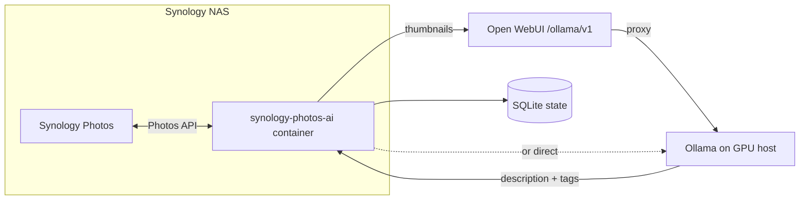

# synology-photos-ai

A Python companion for [Synology Photos](https://www.synology.com/en-us/dsm/feature/photos) that uses a **vision LLM** (typically [Ollama](https://ollama.com) on a separate GPU machine) to:

- **Describe** photos with a short natural-language caption
- **Tag** photos with searchable general tags in Synology Photos
- **Watch** the Recently Added feed and process new uploads automatically

This app talks to Synology Photos over the network and sends **photo thumbnails** to a vision model for analysis. The recommended setup is a **local [Ollama](https://ollama.com) instance on your own hardware** — your images never leave your network and are not sent to OpenAI, Google, or any other third-party AI service. OpenAI cloud is supported as an optional alternative if you explicitly configure it.

Many Synology NAS models can run this app themselves via **Container Manager** (Docker) — a common layout is: companion container on the NAS, vision inference on a separate GPU machine on your LAN. See [Running on Synology NAS](#running-on-synology-nas-container-manager).

Synology does not publish an official Photos API. This project builds on community reverse-engineering documented in [zeichensatz/SynologyPhotosAPI](https://github.com/zeichensatz/SynologyPhotosAPI).

## Architecture



The companion app is lightweight — it does **not** run Ollama or load models. It can run on the NAS (Docker), on another server, or on your laptop. Inference runs on **your** Ollama instance (directly or via a self-hosted Open WebUI on your LAN), so private family photos stay under your control.

## Privacy

Photo libraries on a Synology NAS are often personal — holidays, children, home life. This project is designed around **local inference** so you are not uploading those images to a cloud AI provider by default.

| Setup | Where thumbnails go | Typical privacy profile |
| --- | --- | --- |
| **Local Ollama** (recommended) | Your GPU machine on the LAN | Photos stay on your network; no third-party AI sees them |
| **Open WebUI `/ollama/v1`** (self-hosted) | Your Open WebUI server → your Ollama backend | Same as above, as long as Open WebUI and Ollama are yours |
| **OpenAI cloud** (`OPENAI_API_BASE` unset) | OpenAI's servers over the internet | Thumbnails are sent to a third party — only use if you accept that |

What this app sends for analysis is a **downscaled thumbnail** from Synology Photos, not necessarily the full-resolution original — but that thumbnail can still be sensitive. With local Ollama, the flow is: NAS → this app → your Ollama host → tags/descriptions back to NAS. Nothing transits the public internet unless you choose OpenAI cloud or expose Ollama/Open WebUI outside your network.

**Tips for keeping analysis private:**

- Set `OPENAI_API_BASE` to your local Ollama or self-hosted Open WebUI URL.
- Do not expose Ollama (port 11434) or Open WebUI to the internet without authentication and a clear reason.
- Leave `OPENAI_API_BASE` empty only if you intentionally want OpenAI cloud processing.

## Requirements

- **Synology NAS** with Synology Photos installed, plus a [DSM service account](#dsm-service-account-2fa--shared-space) if your main user has 2FA
- **Ollama** on a separate machine with a **vision model** (default **`llava-llama3`**; or `bakllava` for fast bulk runs) — see [Vision hardware](#vision-hardware-typical) for GPU/RAM guidance
  - Connect **directly** (`http://<gpu-host>:11434/v1`) or **via [Open WebUI](https://docs.openwebui.com)** (`http://<open-webui-host>:<port>/ollama/v1`)
  - The app host must reach whichever endpoint you configure
- **Where to run this app** (pick one):
  - **On the Synology NAS** via [Container Manager](#running-on-synology-nas-container-manager) (Docker) — no separate server needed
  - **Python 3.11+** on any Linux/macOS/Windows host
  - **Docker** on any Docker-capable machine

Alternatively, use OpenAI cloud by omitting `OPENAI_API_BASE` — see [Privacy](#privacy) before doing so.

## Quick start

### 1. Configure `.env`

```bash
cp .env.example .env
```

Example for **external Ollama on a GPU box** (direct):

```bash
# Synology NAS
SYNOLOGY_HOST=192.168.1.10
SYNOLOGY_USERNAME=your_user
SYNOLOGY_PASSWORD=your_password
SYNOLOGY_SPACE=personal

# Direct Ollama (LAN IP of the GPU machine)
OPENAI_API_BASE=http://192.168.1.50:11434/v1
OPENAI_API_KEY=ollama
OPENAI_MODEL=llava-llama3
```

Pull the model on your Ollama host first: `ollama pull llava-llama3`

If Ollama is fronted by **Open WebUI**, use its Ollama proxy instead — see [Open WebUI](#open-webui-ollama-proxy).

If your main DSM account has **2FA** enabled, create a [dedicated service account](#dsm-service-account-2fa--shared-space) and use **Shared Space** so that user can see your library.

### 2. Install and run (local)

```bash
python3.11 -m venv .venv
source .venv/bin/activate
pip install -e .

synology-photos-ai ping                              # test NAS login
synology-photos-ai process --limit 5 --dry-run       # test Ollama + vision (no writes)
synology-photos-ai process                           # batch tag library
synology-photos-ai process --force --limit 20        # re-tag: replace ai-* tags + description
synology-photos-ai watch                             # poll Recently Added
```

### 3. Or run with Docker

The container runs only this app. Ollama stays on your GPU machine. This includes [running on the Synology NAS itself](#running-on-synology-nas-container-manager).

```bash
docker compose build
docker compose run --rm synology-photos-ai ping
docker compose run --rm synology-photos-ai process --limit 5 --dry-run
docker compose up -d    # background watcher
```

See [Docker](#docker) for networking details.

## Configuration

| Variable | Description |
| --- | --- |
| `SYNOLOGY_HOST` | NAS hostname or IP with HTTPS port if needed (e.g. `192.168.1.10:5001`). No `https://` prefix. When the container runs **on the NAS**, use the NAS LAN IP, not `localhost`. |
| `SYNOLOGY_PHOTOS_ALIAS` | Custom URL alias for Synology Photos (default `photo`). Set **empty** if Photos is only opened via DSM (`?launchApp=SYNO.Foto…`) and `/photo/webapi` returns HTTP 403 — the app will use `/webapi/entry.cgi` on port 5001 instead. |
| `SYNOLOGY_USERNAME` / `SYNOLOGY_PASSWORD` | DSM account for API login — see [DSM service account](#dsm-service-account-2fa--shared-space). Quote the password if it contains `#` with a space before it. |
| `SYNOLOGY_SPACE` | `personal` (logged-in user’s Photos tab) or `shared` ([Shared Space](#shared-space-library) — typical for a service account) |
| `SYNOLOGY_THUMBNAIL_SIZE` | NAS thumbnail: `sm` (default, ~360px), `m`, or `xl`. Use `sm` with Ollama |
| `VISION_MAX_EDGE` | Resize before vision API (default `512` px longest edge; `0` = off). Cuts Ollama encode time |
| `SYNOLOGY_VERIFY_SSL` | Set `true` if using a valid TLS cert |
| `OPENAI_API_BASE` | Vision API base URL — see [Direct Ollama](#direct-ollama) or [Open WebUI](#open-webui-ollama-proxy). Leave empty for OpenAI cloud. |
| `OPENAI_API_KEY` | Open WebUI: API key from Settings → Account. Direct Ollama: any non-empty string (e.g. `ollama`). OpenAI: real key. |
| `OPENAI_MODEL` | Vision model on your Ollama host (default **`llava-llama3`**; also `bakllava`, `llama3.2-vision`, …) or OpenAI model |
| `OPENAI_MAX_TOKENS` | Max completion tokens per photo (default `256`). With Ollama this is `num_predict`. Lower = faster; retries use a smaller cap |
| `TAG_PREFIX` | Prefix for generated tags (default `ai`, e.g. `ai-beach`) |
| `MAX_TAGS` | Max tags per photo (default 12) |
| `SKIP_IF_TAGGED` | Skip photos that already have `ai-*` tags (ignored when using `--force`) |
| `WRITE_DESCRIPTION` | Write description via `Browse.Item.set` (metadata/EXIF field — see [Notes](#notes-and-limitations)) |
| `WATCH_INTERVAL_SECONDS` | Poll interval for `watch` (default 300) |
| `STATE_PATH` | SQLite state file (default `.state/processed.db`; Docker uses `/data/processed.db`) |

### Re-tagging after a model change

Photos already tagged by an older run (e.g. `bakllava`) are skipped by default — local SQLite state and/or existing `ai-*` tags on Synology. To **replace** them with a new model (`llava-llama3`, etc.):

1. Set `OPENAI_MODEL` to the new model in `.env`.
2. Dry-run first:

```bash
synology-photos-ai process --force --limit 10 --dry-run
```

3. Apply:

```bash
synology-photos-ai process --force --limit 100   # or omit --limit for the whole library
```

`--force` bypasses skip rules, **removes existing `ai-*` tags** (per `TAG_PREFIX`) on each photo, writes the new tags, and **overwrites the description**. Non-`ai-*` tags you added manually are left alone.

To re-process only photos that have `ai-*` tags but are not in local state, set `SKIP_IF_TAGGED=false` instead of `--force` (tags will accumulate unless you also use `--force`).

## DSM service account (2FA & Shared Space)

Synology’s API login (`SYNO.API.Auth`) does **not** complete the normal 2FA (OTP/authenticator) flow used by the DSM web UI. If your everyday account has 2FA enabled, you will see API error **403** until you use a separate account **without** 2FA, or an app-specific password if your DSM version provides one.

This app also authenticates as a **specific DSM user**. With `SYNOLOGY_SPACE=personal`, it only sees that user’s **Personal Space** — not another account’s timeline. A new `photos-ai` user with an empty Personal Space shows `Connected — 0 items` even when your main library has thousands of photos.

The setup that works well in practice:

1. A **dedicated DSM user** for automation (no 2FA).
2. Library content in **Shared Space**, with `SYNOLOGY_SPACE=shared`.
3. That user in the **`administrators`** group (required on many NAS models for API login; without it you may get error **402** *Denied permission* even when the user can open Photos in the browser).

### Create the service account

In **DSM → Control Panel → User & Group → Create**:

| Setting | Recommendation |
| --- | --- |
| **Username** | e.g. `photo-assistant` (used as `SYNOLOGY_USERNAME`) |
| **Password** | Strong, unique; use quotes in `.env` if it contains `#`, `@`, or leading `?` |
| **2FA** | **Disabled** for this account |
| **Groups** | Add to **`administrators`** (needed for API login on many systems) |

Then:

1. **Log in once** as that user at `https://<nas>:5001` and open **Synology Photos** so the account is initialized.
2. **Applications** (under User & Group → the user → Applications / Permissions): allow **Synology Photos**.
3. Confirm the user is **enabled** and not blocked under **Control Panel → Security** (auto block / too many failed logins).

Put credentials in `.env`:

```bash
SYNOLOGY_USERNAME=photo-assistant
SYNOLOGY_PASSWORD="your-password"
SYNOLOGY_SPACE=shared
SYNOLOGY_PHOTOS_ALIAS=
SYNOLOGY_VERIFY_SSL=false
```

`SYNOLOGY_PHOTOS_ALIAS=` (empty) is for NAS setups where Photos is opened via DSM (`?launchApp=SYNO.Foto…`) and `/photo/webapi` returns HTTP **403**; the app then uses `https://<host>/webapi/entry.cgi` on port **5001** instead.

Test:

```bash
synology-photos-ai ping
```

### Shared Space library

**Shared Space** is Synology Photos’ team library (`SYNO.FotoTeam.*` APIs). The service account only processes items it can see there.

**Move or copy your library into Shared Space** (exact UI varies by DSM / Photos version):

- In **Synology Photos**, use **Shared Space** and add/move folders from your main library, or
- Copy image folders on disk into the shared folders that Photos indexes for Shared Space, then let Photos index them.

Grant **photo-assistant** permission to those shared folders (**Control Panel → Shared Folder** → Permissions) if files live on disk outside Photos’ default team paths.

Set in `.env`:

```bash
SYNOLOGY_SPACE=shared
```

**Indexing takes time.** After a large copy, Photos must scan and catalog items. `synology-photos-ai ping` reports how many items the API can list right now — the count often **climbs over hours or days** (e.g. 115 → 367 → 542) until indexing catches up. Wait until the count stabilizes near what you expect in the Photos UI before a full `process` run.

### New uploads going to Shared Space

If you previously backed up phones or cameras to **Personal Space** on your main account, new photos will not appear in Shared Space until you change where uploads land.

Typical adjustments:

- **Synology Photos mobile app** — backup/save location → **Shared Space** (or the team folder you use).
- **DSM / other backup tasks** — target shared folders that Photos monitors for Shared Space, not only your personal home directory.
- **Manual imports** — import or copy into Shared Space folders so the service account and `watch` see them.

Until uploads consistently land in Shared Space, `watch` and batch `process` will only tag what Shared Space already contains.

### API login errors (quick reference)

| Code | Meaning | What to try |
| --- | --- | --- |
| HTTP **403** on `/photo/webapi/…` | Photos portal alias not in use | Set `SYNOLOGY_PHOTOS_ALIAS=` (empty) or configure alias `photo` in **Login Portal → Applications** |
| **400** | Wrong account or password | Fix `.env`; quote passwords with special characters |
| **401** | Account disabled | Enable user in **User & Group** |
| **402** | Denied permission | Add user to **administrators**; allow **Synology Photos** application |
| **403** (JSON) | 2FA required | Dedicated user **without** 2FA, or app password |
| `0 items` (personal) | Empty Personal Space for that user | Use **shared** space and copy library, or share albums into that user’s personal library |

Official reference: [DSM Login Web API Guide](https://global.download.synology.com/download/Document/Software/DeveloperGuide/Os/DSM/All/enu/DSM_Login_Web_API_Guide_enu.pdf) (auth error codes).

## Ollama (external instance)

**Why local Ollama?** Vision analysis runs entirely on hardware you control. Private photos are not shared with external AI services — only with the model running on your GPU box (or a machine on your home network).

Ollama exposes an OpenAI-compatible API at `/v1`. This project uses LangChain's `ChatOpenAI`, which appends `/chat/completions` to whatever you set in `OPENAI_API_BASE`.

### Direct Ollama

Connect straight to Ollama on your GPU machine:

```bash
OPENAI_API_BASE=http://192.168.1.50:11434/v1
OPENAI_API_KEY=ollama
OPENAI_MODEL=llava-llama3
```

**Important:** `localhost` only works if Ollama runs on the **same machine** as this app. From Docker, `localhost` is the container — use the GPU host's IP or `host.docker.internal` (see Docker section).

### Allow remote connections on the Ollama host

By default Ollama binds to `127.0.0.1`. On the GPU machine, expose it on the network:

```bash
# One-off
OLLAMA_HOST=0.0.0.0 ollama serve

# systemd: add Environment=OLLAMA_HOST=0.0.0.0 to the ollama service, then restart
```

Ensure port **11434** is reachable from the app host (firewall/LAN).

### Vision models

You need a model that accepts images. **Start with `llava-llama3`** — it balances description quality with structured JSON tags on most GPU setups.

| Model | Speed (typical) | Quality |
| --- | --- | --- |
| **`llava-llama3`** (default) | **~10–30 s/photo** on a mid GPU | Recommended starting point — good captions and reliable `ai-*` tags via JSON |
| `bakllava` | **~0.3–1 s/photo** — best for large libraries | One-line descriptions; tags guessed from words (not model JSON). May miscount or miss nuance |
| `llama3.2-vision` | **~20–60+ s/photo** on a mid GPU | Similar role to `llava-llama3`; can be slower or pickier about JSON on some hosts |

For **thousands of photos**, switch to `bakllava`, then re-tag a subset with `--force` and `llava-llama3` if you want better metadata on favorites.

Pull on the Ollama host: `ollama pull llava-llama3` (or `ollama pull bakllava` for speed-first runs)

### Vision hardware (typical)

This project splits work across two machines:

| Role | What it does | Typical hardware |
| --- | --- | --- |
| **Companion app** | Synology API, thumbnails, SQLite state | Synology NAS (Docker), or any small PC — **CPU and RAM are light** (often under 512 MB for the container) |
| **Inference host** | Ollama + vision model | A **separate** desktop, workstation, or server with a **GPU** (recommended) |

You do **not** need a powerful GPU on the NAS. Most Synology units are a poor fit for local vision models (no discrete GPU, limited RAM). Run Ollama on a machine built for AI, and point `OPENAI_API_BASE` at it over the LAN.

#### Inference host — rule of thumb

Vision models are much heavier than text-only chat. Requirements depend on model size, quantization, and whether the GPU runs other jobs at the same time.

| Setup | VRAM / memory | What to expect |
| --- | --- | --- |
| **Recommended** | **NVIDIA GPU with 12 GB+ VRAM** (e.g. RTX 3060 12 GB, RTX 4070, used workstation cards) | Comfortable for `llava-llama3` / `llama3.2-vision` / `bakllava`-class models; room if Ollama shares the GPU with other apps |
| **Workable** | **8 GB VRAM** | Often enough for 11B-class vision models at default Ollama quants; may be tight if another workload holds VRAM — use smaller batches or run tagging when the GPU is idle |
| **Apple Silicon** | **16 GB+ unified memory** (M-series Mac mini / Studio) | Common home-lab setup; Ollama uses unified RAM instead of VRAM. Prefer 24 GB+ if the Mac also runs heavy desktop apps |
| **CPU only** | **16 GB+ system RAM**, fast CPU | Usable for tests (`--limit 5 --dry-run`); **not** practical for large libraries (often tens of seconds to minutes **per photo**) |

Also plan **disk** on the inference host for model weights (often **~5–15 GB** per vision model) and a few GB of free RAM for the OS and Ollama outside VRAM.

#### Throughput and sharing the GPU

The companion app requests **one photo at a time** (thumbnail in, tags out). Rough ballparks on a mid-range GPU with `llava-llama3`:

- **~1–30+ seconds per photo** depending on GPU, model, image size, and load (varies a lot photo-to-photo on the same run)
- **Hundreds of photos** → plan for **hours to overnight** for a full `process` run
- **`watch`** with a long `WATCH_INTERVAL_SECONDS` spreads load for new uploads

If the same Ollama instance serves chat, coding assistants, or other models, expect **queues and slower tagging** when the GPU is busy. The app skips failed photos without marking them done, so you can re-run `process` later; it does not yet implement long backoffs for an overloaded server.

On the Ollama host you can tune queue behavior (e.g. `OLLAMA_NUM_PARALLEL`, `OLLAMA_MAX_QUEUE`) — see the [Ollama FAQ](https://github.com/ollama/ollama/blob/main/docs/faq.md).

#### Network

Only **thumbnails** (not full RAW/TIFF originals) are sent to Ollama. A **gigabit LAN** between NAS and inference host is usually sufficient. Wi‑Fi can work but adds latency; wired Ethernet is preferable for large batch jobs.

#### OpenAI cloud

If you omit `OPENAI_API_BASE`, inference runs on **OpenAI’s** hardware — no local GPU required. See [Privacy](#privacy) before choosing that path.

### Troubleshooting

| Symptom | Likely cause |
| --- | --- |
| Connection refused to `:11434` | Ollama not running, or still bound to localhost |
| Model not found | Model not pulled on the Ollama host |
| `LengthFinishReasonError` / length limit reached (e.g. 40960 completion tokens) | Ollama ignored output limits — ensure `OPENAI_API_BASE` is set (app sends `num_predict`), set `OPENAI_MAX_TOKENS=512`, try `llava-llama3` |
| Many `non-JSON` / `plain-text vision` log lines with `bakllava` | Expected — one Ollama call per photo; tags come from description words. For JSON-native tags use `llava-llama3` |
| `non-JSON` then `Second vision call (JSON retry)` with `llava-llama3` | Normal — the app retries once with a stricter prompt before word-split fallbacks |

### Open WebUI (Ollama proxy)

If you run Ollama behind [Open WebUI](https://docs.openwebui.com), you can use its **OpenAI-compatible Ollama endpoint** instead of hitting Ollama directly. Open WebUI proxies Ollama under `/ollama` and exposes standard OpenAI paths such as `/ollama/v1/chat/completions`.

```bash
OPENAI_API_BASE=http://192.168.1.60:8080/ollama/v1
OPENAI_API_KEY=your-open-webui-api-key
OPENAI_MODEL=llava-llama3
```

LangChain resolves this to `POST http://192.168.1.60:8080/ollama/v1/chat/completions`.

**Setup:**

1. In Open WebUI, go to **Settings → Account** and create an **API key**.
2. Set `OPENAI_API_KEY` to that key (Open WebUI requires `Authorization: Bearer …`; the `ollama` placeholder used for direct Ollama will not work).
3. Set `OPENAI_API_BASE` to `http://<open-webui-host>:<port>/ollama/v1` — include the `/ollama/v1` suffix.
4. Set `OPENAI_MODEL` to the model name **as shown in Open WebUI** (e.g. `llava-llama3`, `bakllava`).

Replace `8080` with your Open WebUI port (Docker images often publish `3000:8080`, so the host port may be `3000`).

**Why use Open WebUI instead of direct Ollama?**

| | Direct Ollama | Open WebUI `/ollama/v1` |
| --- | --- | --- |
| URL | `http://<gpu-host>:11434/v1` | `http://<open-webui-host>:<port>/ollama/v1` |
| Auth | None (any non-empty key) | Open WebUI API key required |
| Ollama network exposure | Must bind `OLLAMA_HOST=0.0.0.0` | Ollama can stay on localhost; only Open WebUI needs to be reachable |
| GPU / models | On Ollama host | Unchanged — Open WebUI forwards to its configured Ollama backend |

Open WebUI also has a unified endpoint at `POST /api/chat/completions`, but that path does not follow the standard `/v1/chat/completions` layout that LangChain expects. Use the **`/ollama/v1`** base URL documented above.

Reference: [Open WebUI API endpoints](https://docs.openwebui.com/reference/api-endpoints/) (Ollama API proxy section).

### Using OpenAI cloud instead

Leave `OPENAI_API_BASE` empty and set a real `OPENAI_API_KEY` and model (e.g. `gpt-4o-mini`). **This sends thumbnails to OpenAI's servers.** Use only if you are comfortable with third-party processing of your photo content — see [Privacy](#privacy).

## Docker

Docker runs **only** synology-photos-ai. Your Ollama instance stays external — do not run vision models on the NAS unless you have a GPU-equipped model that supports it.

```bash
cp .env.example .env
# OPENAI_API_BASE=http://192.168.1.50:11434/v1   ← direct Ollama
# OPENAI_API_BASE=http://192.168.1.60:8080/ollama/v1   ← Open WebUI proxy

docker compose build
docker compose run --rm synology-photos-ai ping
docker compose run --rm synology-photos-ai process --limit 5 --dry-run
docker compose up -d
```

Processed-photo state persists in the `synology-photos-ai-state` volume (`/data/processed.db` inside the container).

### Running on Synology NAS (Container Manager)

Many **Plus**, **xs**, and **SA** series Synology NAS models support Docker via the **Container Manager** package (DSM 7.2+; older DSM used **Docker**). This is a practical deployment: the app runs alongside Synology Photos on the same NAS and calls out to your GPU machine for inference.

**Prerequisites**

- Container Manager installed (Package Center)
- Synology Photos installed and working
- SSH enabled (optional but helpful) or use Container Manager's **Project** UI
- Enough free RAM for a small Python container (typically well under 512 MB)

**Suggested layout**

| Component | Where it runs |
| --- | --- |
| Synology Photos + this app | Synology NAS (Container Manager) |
| Ollama + vision models | External GPU machine |
| Open WebUI (optional) | GPU machine or elsewhere on LAN |

**`.env` when the container is on the NAS**

```bash
# Use the NAS own LAN IP — not localhost (localhost inside the container is the container)
SYNOLOGY_HOST=192.168.1.10
SYNOLOGY_USERNAME=photo-assistant
SYNOLOGY_PASSWORD=your_password
SYNOLOGY_SPACE=shared
SYNOLOGY_PHOTOS_ALIAS=
SYNOLOGY_VERIFY_SSL=false

# External GPU machine (unchanged)
OPENAI_API_BASE=http://192.168.1.50:11434/v1
OPENAI_API_KEY=ollama
OPENAI_MODEL=llava-llama3
```

**Deploy via SSH**

```bash
# On your PC: copy the project to the NAS, then SSH in
ssh admin@192.168.1.10
cd /volume1/docker/synology-photos-ai   # or your chosen path
docker compose build
docker compose run --rm synology-photos-ai ping
docker compose up -d
```

Store the project under a shared folder (e.g. `/volume1/docker/synology-photos-ai`). Container Manager → **Project** → **Create** can import the same `docker-compose.yml` if you prefer the GUI.

**Deploy via Container Manager (GUI)**

1. Copy this repository to a shared folder on the NAS.
2. Create `.env` next to `docker-compose.yml` (see above).
3. Open **Container Manager → Project → Create**.
4. Set the path to the project folder and deploy.
5. Check **Container → Logs** for `watch` output.

**Persistence on Synology**

The compose file uses a named volume (`synology-photos-ai-state`). To store state on a host folder instead, replace the volume in `docker-compose.yml`:

```yaml
volumes:
  - /volume1/docker/synology-photos-ai/data:/data
```

**Architecture notes**

- **x86 vs ARM**: Plus/xs models are usually x86_64; Value series may be ARM (e.g. RTD1296, ARMv8). Build the image on the NAS (`docker compose build`) so the architecture matches, or build multi-platform elsewhere.
- **Photos API from container → NAS**: Using the NAS LAN IP for `SYNOLOGY_HOST` avoids loopback issues inside Docker's bridge network.
- **Container → GPU machine**: The NAS container must reach `OPENAI_API_BASE` over LAN — ensure firewall rules allow the NAS to reach port `11434` (Ollama) or your Open WebUI port.
- **Do not run Ollama in NAS Docker for vision**: Most Synology NAS units lack a suitable GPU; use your external VRAM host instead.

### `OPENAI_API_BASE` from inside the container

| Where inference runs | Set `OPENAI_API_BASE` to |
| --- | --- |
| **Ollama on a dedicated GPU box** | `http://<gpu-host-lan-ip>:11434/v1` |
| **Ollama via Open WebUI** | `http://<open-webui-host>:<port>/ollama/v1` |
| **App container on Synology NAS** | Same GPU/Open WebUI URLs as above — the NAS reaches them over LAN |
| Same machine as Docker Desktop (direct Ollama) | `http://host.docker.internal:11434/v1` |
| Same Linux host as Docker (direct Ollama) | Host LAN IP, or `http://172.17.0.1:11434/v1` |

On Linux with Docker Desktop / `host.docker.internal`, uncomment `extra_hosts` in `docker-compose.yml`.

One-shot commands:

```bash
docker compose run --rm synology-photos-ai process --limit 100
docker compose run --rm synology-photos-ai watch --once
```

## How it works

1. Authenticates with `SYNO.API.Auth` against `/photo/webapi/entry.cgi`
2. Lists photos via `SYNO.Foto.Browse.Item` (personal) or `SYNO.FotoTeam.Browse.Item` (shared)
3. Downloads an `xl`/`m`/`sm` thumbnail from the NAS
4. Sends the image to your vision backend (direct Ollama, Open WebUI `/ollama/v1`, or OpenAI cloud) via LangChain structured output (`description`, `tags`)
5. Optionally sets the photo description with `Browse.Item.set` (before tags — on some DSM builds `set` clears tags if it runs last)
6. Creates tags via `Browse.GeneralTag.create` and attaches them with `Browse.Item.add_tag`
7. Records processed photo IDs in SQLite to avoid duplicate work

The `watch` command uses `Browse.RecentlyAdded` instead of scanning the full library.

## API reference

Vendored notes from the community docs live under `docs/SynologyPhotosAPI/`. Upstream:

https://github.com/zeichensatz/SynologyPhotosAPI

Key endpoints used:

- `SYNO.Foto.Browse.Item` — `list`, `add_tag`, `set`
- `SYNO.Foto.Browse.GeneralTag` — `create`, `list`
- `SYNO.Foto.Browse.RecentlyAdded` — `list`
- `SYNO.Foto.Thumbnail` — `get`

Use `SYNO.FotoTeam.*` equivalents when `SYNOLOGY_SPACE=shared`.

## Notes and limitations

- **Unofficial Synology API**: Methods and parameters may change with DSM/Photos updates. Use `--dry-run` before bulk runs.
- **Privacy-first design**: Local Ollama (or self-hosted Open WebUI) keeps photo thumbnails on your network; cloud AI is opt-in only.
- **NAS Docker deployment**: Many Synology models can run this container via Container Manager; keep Ollama on a GPU host — the NAS is a thin client like any other Docker host.
- **Descriptions**: Written with `Browse.Item.set` into the photo’s **metadata (EXIF ImageDescription)**. In the Photos app, open a photo → **Info** (ⓘ) → **Description**; descriptions are also used for **search**. Set `WRITE_DESCRIPTION=false` to skip description writes. The app applies **tags after** the description write because on some DSM versions `set` can clear tags if it runs last.
- **Tags**: Shown under the photo’s tag list in Photos (and in search). Fallback paths (first-paragraph ramble, plain text, or JSON with an empty `tags` array) still **try** to tag by splitting words from the description (`ai-*` prefix applied). If the caption is too short or only stopwords, you get a description but `no tags generated` in the log. If you see descriptions but no tags, check the terminal for that warning vs `Applied N tag(s)`.
- **Videos**: Only `photo` and `live` still types are processed.
- **Inference cost**: Local Ollama uses your own hardware at no per-image API fee; OpenAI cloud charges per image and receives your thumbnails.
- **Tag prefix**: Default `ai-` prefix makes it easy to filter AI-generated tags in Synology Photos.

## Development

```bash
pip install -e ".[dev]"
python -m synology_photos_ai --help
```

## License

MIT
