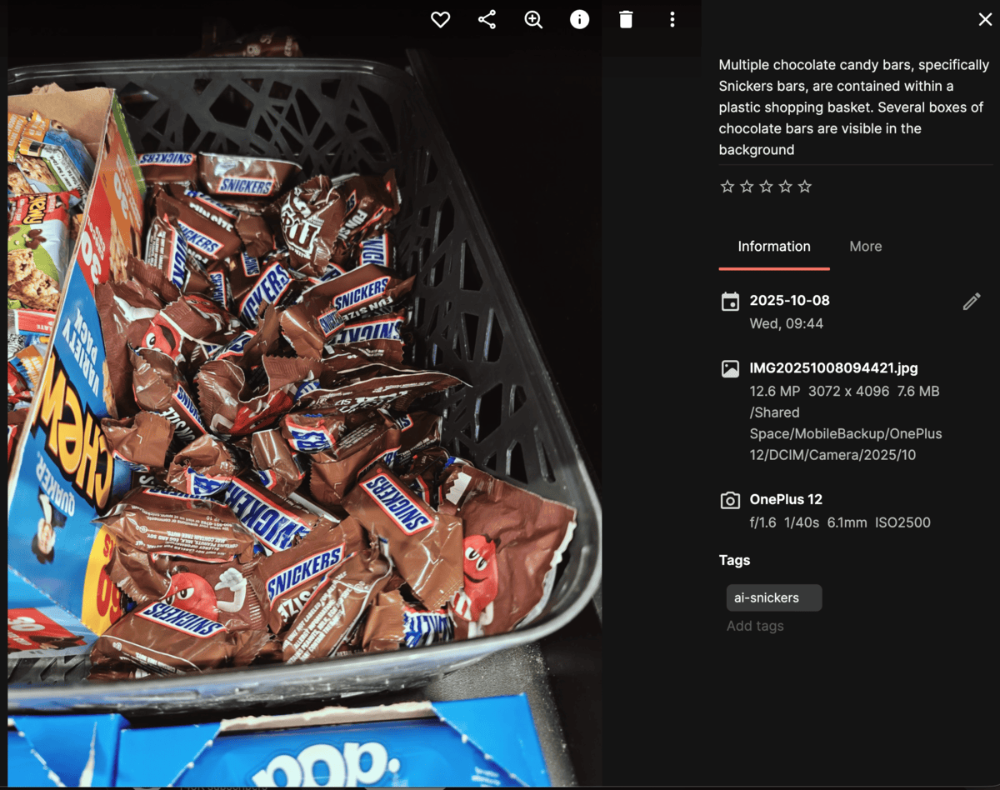
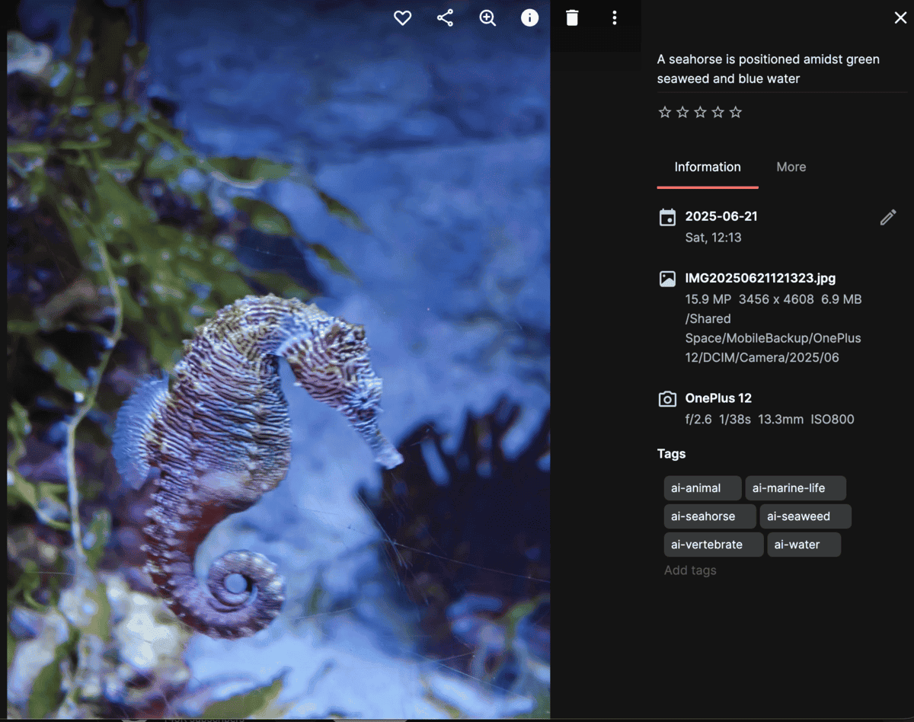
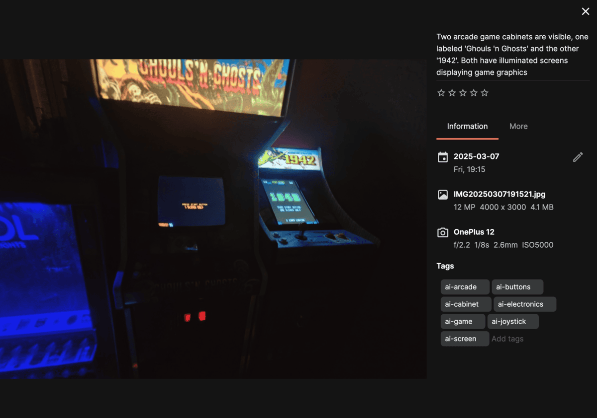
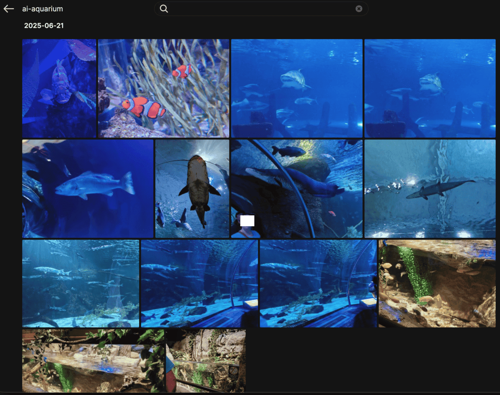
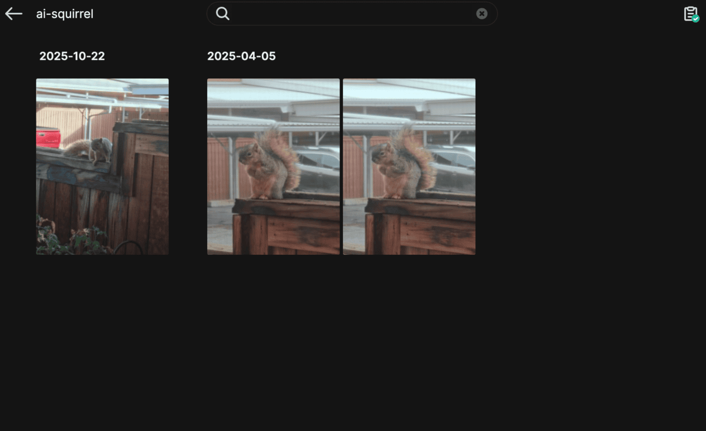
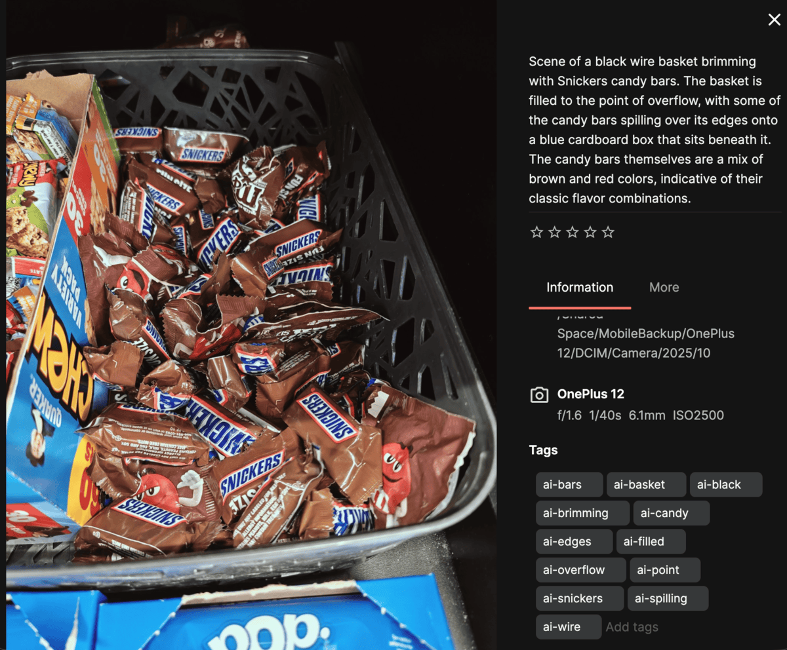
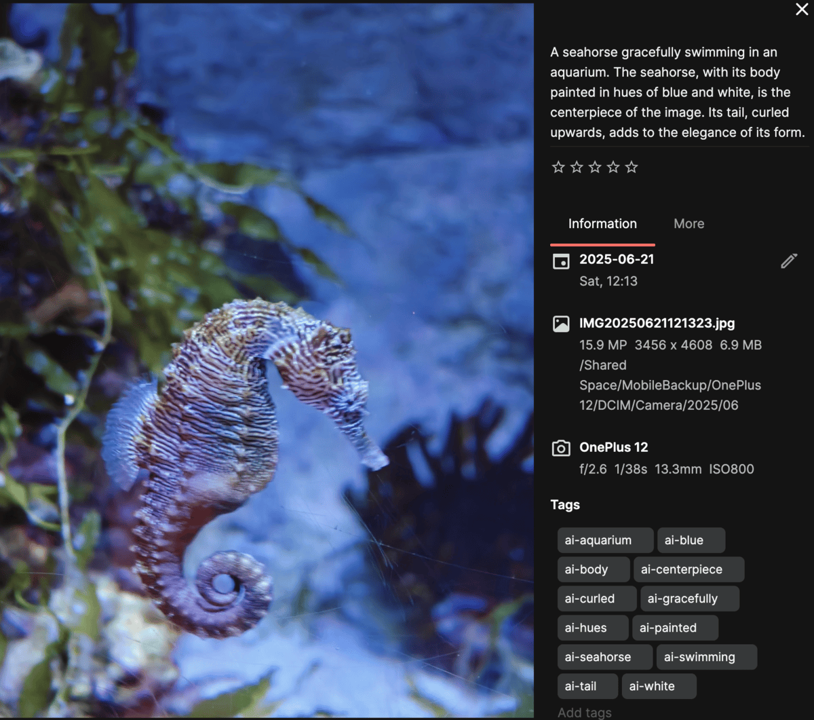
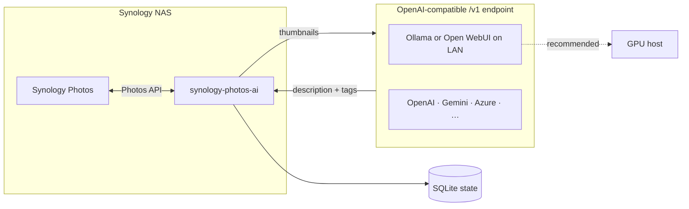

# synology-photos-ai

A Python companion for [Synology Photos](https://www.synology.com/en-us/dsm/feature/photos) that uses a **vision LLM** (typically [Ollama](https://ollama.com) on a separate GPU machine) to:

- **Describe** photos with a short natural-language caption
- **Tag** photos with searchable general tags in Synology Photos
- **Watch** the Recently Added feed and process new uploads automatically

This app talks to Synology Photos over the network and sends **photo thumbnails** to a vision model for analysis. The recommended setup is a **local [Ollama](https://ollama.com) instance on your own hardware** — your images never leave your network. You can also point `OPENAI_API_BASE` at any **OpenAI-compatible** endpoint (Open WebUI, Google Gemini, Azure OpenAI, etc.); see [OpenAI-compatible endpoints](README.md#openai-compatible-endpoints). Native OpenAI cloud works when `OPENAI_API_BASE` is unset.

Many Synology NAS models can run this app themselves via **Container Manager** (Docker) — a common layout is: companion container on the NAS, vision inference on a separate GPU machine on your LAN. See [Running on Synology NAS](README.md#running-on-synology-nas-container-manager).

Synology does not publish an official Photos API. This project builds on community reverse-engineering documented in [zeichensatz/SynologyPhotosAPI](https://github.com/zeichensatz/SynologyPhotosAPI).

## Examples

Screenshots from **Synology Photos** after running `synology-photos-ai process` with **`gemma3`** (Shared Space, reference library). See [Run 2](README.md#run-2-gemma3-complete) for full stats; [Run 1](README.md#run-1-llava-llama3) shows the same scenes with `llava-llama3` for comparison.

### Descriptions and tags

AI-generated **description** and **`ai-*` tags** on a photo’s info panel:







### Search by tags

Photos are findable by searching for generated tags (e.g. `ai-mountain`, `ai-lake`):





## Reference run (real library)

One full **`process --force`** pass on a **Shared Space** library (May 2026). [Examples](README.md#examples) at the top show **gemma3** results; Run 1 below includes **llava-llama3** screenshots of the same photos for comparison. Numbers are from local SQLite state (`.state/processed.db`); your library and hardware will differ.

### Test layout

| Component | Setup |
| --- | --- |
| **NAS** | Synology **RS1221+** (AMD Ryzen), **32 GB RAM** (upgraded from 16 GB default), **DSM 7.3.2-86009 Update 3** |
| **Companion app** | macOS, Python venv on a Mac Studio (LAN) |
| **Synology Photos** | **1.9.0-10924**, Shared Space, **`photo-assistant`** service account (no 2FA), DSM `/webapi/entry.cgi` (empty `SYNOLOGY_PHOTOS_ALIAS`) |
| **DSM auth** | All **human** user accounts have **2FA enabled** — API login requires a [dedicated service account](README.md#dsm-service-account-2fa--shared-space) without 2FA and **Shared Space** for library access |
| **Vision** | Ollama on **Ubuntu 24.04** — Run 1: `llava-llama3:latest`; Runs 2–3: `gemma3` (4500 `:11434`, then 5070 Ti `:11435`) |
| **GPUs** | [RTX PRO 4500](https://www.nvidia.com/en-us/products/workstations/professional-desktop-gpus/rtx-pro-4500/) (32 GB, `:11434`) + [GeForce RTX 5070 Ti](https://www.nvidia.com/en-us/geforce/graphics-cards/50-series/rtx-5070-family/) (16 GB, `:11435`) — see [Dual GPU Ollama](README.md#dual-gpu-ollama-two-instances-one-machine) |

<a id="run-1-llava-llama3"></a>

### Run 1: `llava-llama3:latest` [RTX PRO 4500](https://www.nvidia.com/en-us/products/workstations/professional-desktop-gpus/rtx-pro-4500/) (complete)

| Metric | Result |
| --- | --- |
| **Wall time** | ~14 hours (07:51 → 21:48 UTC) |
| **Throughput** | ~**735 photos/hour** (~**5 s/photo** end-to-end, NAS + vision + writes) |
| **Tags** | **100%** received tags; **~11.9** tags/photo avg (**98.7%** at the 12-tag cap) |
| **Descriptions** | **100%** written (avg ~300 characters) |
| **File mix** | ~**58%** JPG/JPEG, ~**42%** NEF; ~**2,300** basename pairs tagged as **both** RAW + JPEG |
| **JSON reliability** | Frequent **non-JSON** replies → second vision call or word-split fallbacks; many `ai-has` / `ai-moment` tags |

**`.env` settings:** `SYNOLOGY_THUMBNAIL_SIZE=m`, `VISION_MAX_EDGE=768`, `OPENAI_MAX_TOKENS=384`, `TAG_PREFIX=ai`, `WRITE_DESCRIPTION=true`.

**Example screenshots** (same photos as [Examples](README.md#descriptions-and-tags) — Run 2 `gemma3` for contrast):





<a id="run-2-gemma3-complete"></a>

### Run 2: `gemma3` (complete — follow-up `--force`) [RTX PRO 4500](https://www.nvidia.com/en-us/products/workstations/professional-desktop-gpus/rtx-pro-4500/)

Re-tagged the same library with **`OPENAI_MODEL=gemma3`** on the **RTX PRO 4500** (`OPENAI_API_BASE=…:11434/v1`) after prompt/tag-filter updates. [Examples](README.md#examples) show gemma3 metadata on the same photos as Run 1 above.

| Metric | Result |
| --- | --- |
| **Photos** | **10,260** processed (**2** failed of 10,262 scanned) |
| **Wall time** | ~**5 h 40 min** (22:18 → 03:59 UTC, May 29–30) |
| **Throughput** | ~**1,810 photos/hour** (~**2 s/photo** end-to-end, NAS + vision + writes) |
| **Tags** | **100%** received tags; **~9.3** tags/photo avg (**25%** at the 12-tag cap) |
| **Descriptions** | **100%** written (avg ~**116** characters) |
| **File mix** | ~**58%** JPG/JPEG, ~**42%** NEF; ~**2,300** basename pairs as **both** RAW + JPEG |
| **JSON reliability** | **No non-JSON / fallback paths** observed — structured JSON on first call |
| **Quality** | **0** `ai-has` / `ai-moment` junk tags; **0** poetic filler (`serene`, `tranquil`, …) in descriptions |

**`.env` settings:** same as Run 1 (`SYNOLOGY_THUMBNAIL_SIZE=m`, `VISION_MAX_EDGE=768`, `OPENAI_MAX_TOKENS=384`, `TAG_PREFIX=ai`, `WRITE_DESCRIPTION=true`).

**Run 1 vs Run 2 (same library, same hardware):**

| | Run 1 `llava-llama3` | Run 2 `gemma3` |
| --- | --- | --- |
| **Wall time** | ~14 h | ~**5.7 h** (~**2.5× faster**) |
| **Throughput** | ~735/h (~5 s/photo) | ~**1,810/h** (~**2 s/photo**) |
| **Avg tags** | ~11.9 (99% at cap) | ~9.3 (25% at cap) |
| **Avg description** | ~300 chars | ~116 chars (factual) |
| **Location naming** | Often guessed; Gdańsk sometimes correct, sometimes Warsaw/Belgium | Rarely guesses; generic unless landmark obvious — see **`USE_LOCATION_IN_PROMPT`** |

**Recommendation:** **`gemma3`** is the preferred default for this project — faster, reliable JSON, cleaner tags, no poetic filler. Enable **`USE_LOCATION_IN_PROMPT=true`** to add city/country from EXIF GPS when Synology geocoding is available.

Pull on the Ollama host: `ollama pull gemma3` (use the exact name from `ollama list`).

<a id="run-2b-gemma3-on-rtx-5070-ti-20-photo-benchmark"></a>

### Run 2b: `gemma3` on [GeForce RTX 5070 Ti](https://www.nvidia.com/en-us/geforce/graphics-cards/50-series/rtx-5070-family/) (20-photo benchmark)

While the full library pass continued on the **4500** (`:11434`), a separate Ollama instance on the **[5070 Ti](https://www.nvidia.com/en-us/geforce/graphics-cards/50-series/rtx-5070-family/)** (`:11435`) was tested with the same model and `.env` settings (only `OPENAI_API_BASE` changed). Setup: [Dual GPU Ollama](README.md#dual-gpu-ollama-two-instances-one-machine).

| Metric | [RTX PRO 4500](https://www.nvidia.com/en-us/products/workstations/professional-desktop-gpus/rtx-pro-4500/) (`:11434`) | [GeForce RTX 5070 Ti](https://www.nvidia.com/en-us/geforce/graphics-cards/50-series/rtx-5070-family/) (`:11435`) |
| --- | --- | --- |
| **Test** | Full library `--force` (**complete** — 10,260 photos) | `process --force --limit 20` |
| **Vision latency** | ~**0.7–1.0 s/photo** (vision only) | ~**1.5–2 s/photo** end-to-end (NAS + vision + writes, concurrent with 4500 run) |
| **`gemma3` VRAM** | ~**6.8 GB** loaded (shared with Whisper on same GPU) | ~**4 GB** loaded; **~12 GB** headroom on 16 GB |
| **JSON / quality** | Reliable JSON, clean tags | Same — no fallbacks; sensible noun tags |
| **Result** | — | **20 / 20** processed, **0** failed |

**Takeaway:** A **12 GB+ consumer GPU** (5070 Ti class) is a practical inference host for `gemma3` tagging. Running a **second Ollama on the other GPU** keeps bulk tagging off the workstation card when Whisper or other jobs use the 4500.

```bash
# Benchmark the secondary GPU without stopping the primary instance
OPENAI_API_BASE=http://192.168.1.62:11435/v1 OPENAI_MODEL=gemma3 \
  synology-photos-ai process --force --limit 20 -v
```

<a id="run-3-gemma3-complete"></a>

### Run 3: `gemma3` (complete — full library on [5070 Ti](https://www.nvidia.com/en-us/geforce/graphics-cards/50-series/rtx-5070-family/))

Third full **`process --force`** on the same Shared Space library, with **newer pipeline settings** and Ollama on the **5070 Ti only** (`OPENAI_API_BASE=…:11435/v1`) so the **4500** could stay free for other jobs.

| Metric | Result |
| --- | --- |
| **Photos** | **10,258** processed (**2** failed of 10,260 scanned) |
| **Wall time** | ~**9 h 43 min** (22:23 → 08:06 UTC, May 29–30) |
| **Throughput** | ~**1,056 photos/hour** (~**3.4 s/photo** end-to-end, NAS + vision + writes) |
| **Vision only** | ~**0.7–0.9 s/photo** in logs (same ballpark as Run 2) |
| **Tags** | **100%** received tags; **~8.5** tags/photo avg (**9.5%** at the 12-tag cap) |
| **Descriptions** | **100%** written (avg ~**136** characters) |
| **JSON / quality** | **0** `ai-has` / `ai-moment` junk tags; structured JSON on first call |

**`.env` settings (vs Run 2):**

| Setting | Run 2 | Run 3 |
| --- | --- | --- |
| `OPENAI_API_BASE` | `:11434` (4500) | `:11435` (5070 Ti) |
| `SYNOLOGY_THUMBNAIL_SIZE` | `m` | **`l`** |
| `VISION_MAX_EDGE` | `768` | **`1024`** |
| `USE_LOCATION_IN_PROMPT` | off | **`true`** |
| `OPENAI_TEMPERATURE` | (default `0.1`) | `0.1` |
| `REUSE_JPEG_ANALYSIS_FOR_RAW` | (default `true`) | `true` |

**Run 2 vs Run 3 (same model, different GPU + quality settings):**

| | Run 2 (4500, `m`/768) | Run 3 (5070 Ti, `l`/1024 + location) |
| --- | --- | --- |
| **Wall time** | ~**5.7 h** | ~**9.7 h** (~**1.7× longer**) |
| **Throughput** | ~1,810/h (~2 s/photo) | ~1,056/h (~3.4 s/photo) |
| **Avg tags** | ~9.3 | ~8.5 |
| **Avg description** | ~116 chars | ~136 chars |
| **Location in captions** | Generic unless obvious | City/country from Synology geocoding when GPS exists |

**Takeaway:** Larger NAS thumbnails + **`VISION_MAX_EDGE=1024`** and **`USE_LOCATION_IN_PROMPT=true`** cost wall-clock time vs Run 2, but vision inference alone stayed ~sub-second per photo in logs — most of the delta is download/resize and NAS writes. For bulk re-tags, **`m`** + **`768`** on the **4500** remains faster; use Run 3’s settings when you want **richer thumbnails** and **factual place names** in prompts.


### What worked well

- Both full library passes completed with minimal intervention; tags and descriptions show in Photos and **search** (see [Examples](README.md#examples)).
- Run 2 (`gemma3`) finished in ~**5.7 h** vs ~14 h for Run 1 — ~**2.5× faster** with cleaner metadata.
- Run 3 validated **`gemma3`** on the **5070 Ti** for a full library pass with **`USE_LOCATION_IN_PROMPT`** and larger thumbnails — ~**9.7 h**, same JSON quality as Run 2 (see [Run 3](README.md#run-3-gemma3-complete)).
- Local Ollama kept thumbnails on the LAN; NAS API writes (tags + EXIF description) were stable after description-before-tags ordering.

### Room for improvement (Run 1; addressed in Run 2 testing)

| Issue | Approx. impact (Run 1) | Mitigation |
| --- | --- | --- |
| Poetic filler (`serene`, `moment of tranquility`, …) | ~**30%** of descriptions | Stricter prompts + post-processing; re-tag with `--force` |
| Word-split fallback tags (`ai-has`, `ai-moment`, …) when JSON fails | Common on `llava-llama3` | Use a JSON-reliable model such as **`gemma3`**, or JSON retry + tag blocklist |
| Wrong city/landmark guesses | Small but noticeable on travel/architecture (Run 1) | **`gemma3`** avoids guessing; enable **`USE_LOCATION_IN_PROMPT=true`** for EXIF-based city/country |
| **JPG + NEF duplicates** | ~2× API calls for many scenes (Run 1) | Default **`REUSE_JPEG_ANALYSIS_FOR_RAW=true`** — vision on JPEG only, same metadata written to NEF |
| GPU contention (ComfyUI, Whisper, …) | Variable latency | [Dual GPU Ollama](README.md#dual-gpu-ollama-two-instances-one-machine) — second instance on the other card; or pause other VRAM jobs |

For ballpark planning on other hardware, see [Throughput and sharing the GPU](README.md#throughput-and-sharing-the-gpu).

## Architecture



The companion app is lightweight — it does **not** run vision models itself. It can run on the NAS (Docker), on another server, or on your laptop. Point `OPENAI_API_BASE` at any **OpenAI-compatible** chat/completions URL (local Ollama is the usual choice for privacy; cloud providers work too). See [OpenAI-compatible endpoints](README.md#openai-compatible-endpoints).

## Privacy

Photo libraries on a Synology NAS are often personal — holidays, children, home life. This project is designed around **local inference** so you are not uploading those images to a cloud AI provider by default.

| Setup | Where thumbnails go | Typical privacy profile |
| --- | --- | --- |
| **Local Ollama** (recommended) | Your GPU machine on the LAN | Photos stay on your network; no third-party AI sees them |
| **Open WebUI `/ollama/v1`** (self-hosted) | Your Open WebUI server → your Ollama backend | Same as above, as long as Open WebUI and Ollama are yours |
| **OpenAI cloud** (`OPENAI_API_BASE` unset) | OpenAI's servers over the internet | Thumbnails are sent to a third party — only use if you accept that |
| **Other cloud / proxy** (custom `OPENAI_API_BASE`, e.g. Google Gemini) | That provider's servers | Same as OpenAI cloud — read their terms; see [OpenAI-compatible endpoints](README.md#openai-compatible-endpoints) |

What this app sends for analysis is a **downscaled thumbnail** from Synology Photos, not necessarily the full-resolution original — but that thumbnail can still be sensitive. With local Ollama, the flow is: NAS → this app → your Ollama host → tags/descriptions back to NAS. Nothing transits the public internet unless you choose OpenAI cloud or expose Ollama/Open WebUI outside your network.

**Tips for keeping analysis private:**

- Set `OPENAI_API_BASE` to your local Ollama or self-hosted Open WebUI URL.
- Do not expose Ollama (port 11434) or Open WebUI to the internet without authentication and a clear reason.
- Leave `OPENAI_API_BASE` empty only if you intentionally want OpenAI cloud processing.

<a id="cloud-inference-cost-typical"></a>

### Cloud inference cost (typical)

Cloud vision APIs bill **per token**, not per photo. This app sends a **downscaled Synology thumbnail** plus a short prompt and requests ~**250–400 tokens** of JSON (description + tags) — much cheaper than full-resolution analysis, but a **10k library still adds up**.

**Per photo (one describe + tag call):**

| Provider / model | Pricing (approx.) | Per photo | Notes |
| --- | --- | --- | --- |
| **[GPT-4o mini](https://developers.openai.com/api/docs/models/gpt-4o-mini)** | $0.15 / M input, $0.60 / M output | **~$0.0005–0.004** | Images become tokens; gpt-4o-mini can have a **high fixed image token cost** on some resolutions |
| **[GPT-4o](https://openai.com/api/pricing)** | ~$2.50 / M input, ~$10 / M output | **~$0.002–0.015** | Higher quality; more image tokens at larger thumbnail sizes |
| **[Gemini 2.5 Flash-Lite](https://ai.google.dev/gemini-api/docs/pricing)** | $0.10 / M input, $0.40 / M output | **~$0.0003–0.002** | Often among the cheapest cloud vision options; OpenAI-compatible endpoint supported |
| **[Gemini 2.5 Flash](https://ai.google.dev/gemini-api/docs/pricing)** | $0.30 / M input, $2.50 / M output | **~$0.001–0.008** | Better quality, higher cost |
| **Local Ollama (`gemma3`)** | No API fee | **~$0** | Electricity + hardware; see [Run 2](README.md#run-2-gemma3-complete) (~5.7 h for ~10k photos) |

**Full library ballpark (~10,000 photos):**

| Tier | Estimated total |
| --- | --- |
| Budget cloud (Gemini Flash-Lite, gpt-4o-mini) | **~$5–40** |
| Mid cloud (gpt-4o, Gemini Flash) | **~$25–150** |
| Local Ollama | **$0 API** (your GPU + power) |

Actual cloud cost depends on **`SYNOLOGY_THUMBNAIL_SIZE`**, **`VISION_MAX_EDGE`**, **`OPENAI_MAX_TOKENS`**, and provider image-token rules. With **`REUSE_JPEG_ANALYSIS_FOR_RAW=true`**, you pay for **one vision call per scene**, not separate JPG + NEF calls. **`PROCESS_PARALLEL=2`** (or higher) can shorten wall-clock time on cloud endpoints without changing per-photo cost.

Check current rates before bulk runs: [OpenAI pricing](https://openai.com/api/pricing), [Gemini API pricing](https://ai.google.dev/gemini-api/docs/pricing). Use `process --limit 10 --dry-run` on a cloud endpoint to validate billing on your account.

## Requirements

- **Synology NAS** with Synology Photos installed, plus a [DSM service account](README.md#dsm-service-account-2fa--shared-space) if your main user has 2FA
- **Ollama** on a separate machine with a **vision model** (recommended **`gemma3`**; or `llava-llama3` / `bakllava`) — see [Vision hardware](README.md#vision-hardware-typical) for GPU/RAM guidance
  - Connect **directly** (`http://<gpu-host>:11434/v1`) or **via [Open WebUI](https://docs.openwebui.com)** (`http://<open-webui-host>:<port>/ollama/v1`)
  - The app host must reach whichever endpoint you configure
- **Where to run this app** (pick one):
  - **On the Synology NAS** via [Container Manager](README.md#running-on-synology-nas-container-manager) (Docker) — no separate server needed
  - **Python 3.11+** on any Linux/macOS/Windows host
  - **Docker** on any Docker-capable machine

Alternatively, use OpenAI cloud by omitting `OPENAI_API_BASE` — see [Privacy](README.md#privacy) before doing so.

## Quick start

### 1. Configure `.env`

```bash
cp .env.example .env
```

Example for **external Ollama on a GPU box** (direct):

```bash
# Synology NAS
SYNOLOGY_HOST=192.168.1.10
SYNOLOGY_USERNAME=your_user
SYNOLOGY_PASSWORD=your_password
SYNOLOGY_SPACE=personal

# Direct Ollama (LAN IP of the GPU machine)
OPENAI_API_BASE=http://192.168.1.50:11434/v1
OPENAI_API_KEY=ollama
OPENAI_MODEL=llava-llama3
```

Pull the model on your Ollama host first: `ollama pull llava-llama3`

If Ollama is fronted by **Open WebUI**, use its Ollama proxy instead — see [Open WebUI](README.md#open-webui-ollama-proxy).

If your main DSM account has **2FA** enabled, create a [dedicated service account](README.md#dsm-service-account-2fa--shared-space) and use **Shared Space** so that user can see your library.

### 2. Install and run (local)

```bash
python3.11 -m venv .venv
source .venv/bin/activate
pip install -e .

synology-photos-ai ping                              # test NAS login
synology-photos-ai process --limit 5 --dry-run       # test Ollama + vision (no writes)
synology-photos-ai process                           # batch tag library
synology-photos-ai process --force --limit 20        # re-tag: replace ai-* tags + description
synology-photos-ai watch                             # poll Recently Added
```

### 3. Or run with Docker

The container runs only this app. Ollama stays on your GPU machine. This includes [running on the Synology NAS itself](README.md#running-on-synology-nas-container-manager).

```bash
docker compose build
docker compose run --rm synology-photos-ai ping
docker compose run --rm synology-photos-ai process --limit 5 --dry-run
docker compose up -d    # background watcher
```

See [Docker](README.md#docker) for networking details.

## Configuration

| Variable | Description |
| --- | --- |
| `SYNOLOGY_HOST` | NAS hostname or IP with HTTPS port if needed (e.g. `192.168.1.10:5001`). No `https://` prefix. When the container runs **on the NAS**, use the NAS LAN IP, not `localhost`. |
| `SYNOLOGY_PHOTOS_ALIAS` | Custom URL alias for Synology Photos (default `photo`). Set **empty** if Photos is only opened via DSM (`?launchApp=SYNO.Foto…`) and `/photo/webapi` returns HTTP 403 — the app will use `/webapi/entry.cgi` on port 5001 instead. |
| `SYNOLOGY_USERNAME` / `SYNOLOGY_PASSWORD` | DSM account for API login — see [DSM service account](README.md#dsm-service-account-2fa--shared-space). Quote the password if it contains `#` with a space before it. |
| `SYNOLOGY_SPACE` | `personal` (logged-in user’s Photos tab) or `shared` ([Shared Space](README.md#shared-space-library) — typical for a service account) |
| `SYNOLOGY_THUMBNAIL_SIZE` | NAS thumbnail: `sm` (default, ~360px), `m`, or `xl`. Use `sm` with Ollama |
| `VISION_MAX_EDGE` | Resize before vision API (default `512` px longest edge; `0` = off). Cuts Ollama encode time |
| `SYNOLOGY_VERIFY_SSL` | Set `true` if using a valid TLS cert |
| `OPENAI_API_BASE` | Vision API base URL (must end with `/v1`). See [OpenAI-compatible endpoints](README.md#openai-compatible-endpoints), [Ollama](README.md#direct-ollama), or [Open WebUI](README.md#open-webui-ollama-proxy). Leave empty for native OpenAI cloud. |
| `OPENAI_API_KEY` | Provider API key (or any non-empty string for direct Ollama). |
| `OPENAI_MODEL` | Model name **as the endpoint expects** (recommended **`gemma3`** on Ollama; also `llava-llama3`, `bakllava`; e.g. `gpt-4o-mini`, `gemini-2.0-flash`) |
| `OPENAI_MAX_TOKENS` | Max completion tokens per photo (default `256`). With Ollama this is `num_predict`. Lower = faster; retries use a smaller cap |
| `OPENAI_TEMPERATURE` | Vision sampling temperature (default `0.1`). With Ollama passed in `options.temperature`. Use `0` with a fixed seed for max reproducibility |
| `OPENAI_SEED` | Optional fixed seed for Ollama/OpenAI (omit for random). Same seed + same thumbnail → same output; does not help if JPG and NEF thumbnails differ |
| `REUSE_JPEG_ANALYSIS_FOR_RAW` | When `true` (default), run vision once on JPEG/HEIC/etc. and **copy** description + tags to matching RAW/NEF (same basename). Saves ~half the vision calls on RAW+JPEG libraries |
| `USE_LOCATION_IN_PROMPT` | When `true`, include Synology **address** (city, country, landmark from EXIF GPS) in the vision prompt — factual place names without vision guessing. Default **`false`**. Falls back to coordinates only if geocoding is missing |
| `PROCESS_PARALLEL` | Concurrent **vision** calls (download + analyze; default **`1`**). Synology writes (description, tags, SQLite) stay **sequential**. Local Ollama: keep `1` unless you raised `OLLAMA_NUM_PARALLEL`. Cloud APIs: try **`2`–`4`** to hide latency |
| `TAG_PREFIX` | Prefix for generated tags (default `ai`, e.g. `ai-beach`) |
| `MAX_TAGS` | Max tags per photo (default 12) |
| `SKIP_IF_TAGGED` | Skip photos that already have `ai-*` tags (ignored when using `--force`) |
| `WRITE_DESCRIPTION` | Write description via `Browse.Item.set` (metadata/EXIF field — see [Notes](README.md#notes-and-limitations)) |
| `WATCH_INTERVAL_SECONDS` | Poll interval for `watch` (default 300) |
| `STATE_PATH` | SQLite state file (default `.state/processed.db`; Docker uses `/data/processed.db`) |

### Re-tagging after a model change

Photos already tagged by an older run (e.g. `bakllava`) are skipped by default — local SQLite state and/or existing `ai-*` tags on Synology. To **replace** them with a new model (`llava-llama3`, etc.):

1. Set `OPENAI_MODEL` to the new model in `.env`.
2. Dry-run first:

```bash
synology-photos-ai process --force --limit 10 --dry-run
```

3. Apply:

```bash
synology-photos-ai process --force --limit 100   # or omit --limit for the whole library
```

`--force` bypasses skip rules, **removes existing `ai-*` tags** (per `TAG_PREFIX`) on each photo, writes the new tags, and **overwrites the description**. Non-`ai-*` tags you added manually are left alone.

To re-process only photos that have `ai-*` tags but are not in local state, set `SKIP_IF_TAGGED=false` instead of `--force` (tags will accumulate unless you also use `--force`).

## DSM service account (2FA & Shared Space)

Synology’s API login (`SYNO.API.Auth`) does **not** complete the normal 2FA (OTP/authenticator) flow used by the DSM web UI. If your everyday account has 2FA enabled, you will see API error **403** until you use a separate account **without** 2FA, or an app-specific password if your DSM version provides one.

This app also authenticates as a **specific DSM user**. With `SYNOLOGY_SPACE=personal`, it only sees that user’s **Personal Space** — not another account’s timeline. A new `photos-ai` user with an empty Personal Space shows `Connected — 0 items` even when your main library has thousands of photos.

The setup that works well in practice:

1. A **dedicated DSM user** for automation (no 2FA).
2. Library content in **Shared Space**, with `SYNOLOGY_SPACE=shared`.
3. That user in the **`administrators`** group (required on many NAS models for API login; without it you may get error **402** *Denied permission* even when the user can open Photos in the browser).

### Create the service account

In **DSM → Control Panel → User & Group → Create**:

| Setting | Recommendation |
| --- | --- |
| **Username** | e.g. `photo-assistant` (used as `SYNOLOGY_USERNAME`) |
| **Password** | Strong, unique; use quotes in `.env` if it contains `#`, `@`, or leading `?` |
| **2FA** | **Disabled** for this account |
| **Groups** | Add to **`administrators`** (needed for API login on many systems) |

Then:

1. **Log in once** as that user at `https://<nas>:5001` and open **Synology Photos** so the account is initialized.
2. **Applications** (under User & Group → the user → Applications / Permissions): allow **Synology Photos**.
3. Confirm the user is **enabled** and not blocked under **Control Panel → Security** (auto block / too many failed logins).

Put credentials in `.env`:

```bash
SYNOLOGY_USERNAME=photo-assistant
SYNOLOGY_PASSWORD="your-password"
SYNOLOGY_SPACE=shared
SYNOLOGY_PHOTOS_ALIAS=
SYNOLOGY_VERIFY_SSL=false
```

`SYNOLOGY_PHOTOS_ALIAS=` (empty) is for NAS setups where Photos is opened via DSM (`?launchApp=SYNO.Foto…`) and `/photo/webapi` returns HTTP **403**; the app then uses `https://<host>/webapi/entry.cgi` on port **5001** instead.

Test:

```bash
synology-photos-ai ping
```

### Shared Space library

**Shared Space** is Synology Photos’ team library (`SYNO.FotoTeam.*` APIs). The service account only processes items it can see there.

**Move or copy your library into Shared Space** (exact UI varies by DSM / Photos version):

- In **Synology Photos**, use **Shared Space** and add/move folders from your main library, or
- Copy image folders on disk into the shared folders that Photos indexes for Shared Space, then let Photos index them.

Grant **photo-assistant** permission to those shared folders (**Control Panel → Shared Folder** → Permissions) if files live on disk outside Photos’ default team paths.

Set in `.env`:

```bash
SYNOLOGY_SPACE=shared
```

**Indexing takes time.** After a large copy, Photos must scan and catalog items. `synology-photos-ai ping` reports how many items the API can list right now — the count often **climbs over hours or days** (e.g. 115 → 367 → 542) until indexing catches up. Wait until the count stabilizes near what you expect in the Photos UI before a full `process` run.

### New uploads going to Shared Space

If you previously backed up phones or cameras to **Personal Space** on your main account, new photos will not appear in Shared Space until you change where uploads land.

Typical adjustments:

- **Synology Photos mobile app** — backup/save location → **Shared Space** (or the team folder you use).
- **DSM / other backup tasks** — target shared folders that Photos monitors for Shared Space, not only your personal home directory.
- **Manual imports** — import or copy into Shared Space folders so the service account and `watch` see them.

Until uploads consistently land in Shared Space, `watch` and batch `process` will only tag what Shared Space already contains.

### API login errors (quick reference)

| Code | Meaning | What to try |
| --- | --- | --- |
| HTTP **403** on `/photo/webapi/…` | Photos portal alias not in use | Set `SYNOLOGY_PHOTOS_ALIAS=` (empty) or configure alias `photo` in **Login Portal → Applications** |
| **400** | Wrong account or password | Fix `.env`; quote passwords with special characters |
| **401** | Account disabled | Enable user in **User & Group** |
| **402** | Denied permission | Add user to **administrators**; allow **Synology Photos** application |
| **403** (JSON) | 2FA required | Dedicated user **without** 2FA, or app password |
| `0 items` (personal) | Empty Personal Space for that user | Use **shared** space and copy library, or share albums into that user’s personal library |

Official reference: [DSM Login Web API Guide](https://global.download.synology.com/download/Document/Software/DeveloperGuide/Os/DSM/All/enu/DSM_Login_Web_API_Guide_enu.pdf) (auth error codes).

<a id="openai-compatible-endpoints"></a>

## OpenAI-compatible endpoints

Inference uses LangChain’s `ChatOpenAI`, which calls **`POST {OPENAI_API_BASE}/chat/completions`** with an image + text in the chat payload. Any provider that implements the **OpenAI Chat Completions API** (including multimodal / vision messages) can be used — you are not limited to Ollama or OpenAI.

| Approach | `OPENAI_API_BASE` | Notes |
| --- | --- | --- |
| **Local Ollama** (recommended) | `http://<gpu-host>:11434/v1` | Private LAN; see [Ollama](README.md#ollama-external-instance) |
| **Open WebUI** | `http://<host>:<port>/ollama/v1` | Proxies to Ollama; see [Open WebUI](README.md#open-webui-ollama-proxy) |
| **OpenAI** | *(leave empty)* | Uses the official API + structured output; see [OpenAI cloud](README.md#using-openai-cloud-instead) |
| **Google Gemini** | `https://generativelanguage.googleapis.com/v1beta/openai/` | [OpenAI-compatible Gemini API](https://ai.google.dev/gemini-api/docs/openai); vision model e.g. `gemini-2.0-flash` |
| **Azure OpenAI** | Your deployment URL + `/openai/v1` | Model name = your deployment id |
| **Other gateways** | LiteLLM, vLLM, Together, etc. | Point at whatever exposes `/v1/chat/completions` |

Example — **Google Gemini** (thumbnails sent to Google; see [Privacy](README.md#privacy)):

```bash
OPENAI_API_BASE=https://generativelanguage.googleapis.com/v1beta/openai/
OPENAI_API_KEY=your-gemini-api-key
OPENAI_MODEL=gemini-2.0-flash
```

Example — **OpenAI via explicit base URL** (equivalent to leaving `OPENAI_API_BASE` empty for many setups):

```bash
OPENAI_API_BASE=https://api.openai.com/v1
OPENAI_API_KEY=sk-...
OPENAI_MODEL=gpt-4o-mini
```

**Requirements for any endpoint**

- The model must accept **vision** input (`image_url` in the user message).
- The base URL should include the **`/v1`** suffix (no trailing path beyond that).
- Run `synology-photos-ai process --limit 3 --dry-run` after changing providers.

See [Cloud inference cost (typical)](README.md#cloud-inference-cost-typical) for per-photo and full-library ballparks vs local Ollama.

**Ollama-specific behavior:** When `OPENAI_API_BASE` is set, the app also sends Ollama-oriented fields (`format: json`, `options.num_predict`, `options.temperature`, and `options.seed` when `OPENAI_SEED` is set) for better tagging on local models. Most other providers ignore unknown JSON fields; if a provider rejects them, use native OpenAI (`OPENAI_API_BASE` empty) or a proxy that strips extras. Non-Ollama endpoints may work best with models that return clean JSON; otherwise fallbacks derive tags from the description text.

## Ollama (external instance)

**Why local Ollama?** Vision analysis runs entirely on hardware you control. Private photos are not shared with external AI services — only with the model running on your GPU box (or a machine on your home network).

Ollama exposes an OpenAI-compatible API at `/v1`. This project uses LangChain's `ChatOpenAI`, which appends `/chat/completions` to whatever you set in `OPENAI_API_BASE`.

### Direct Ollama

Connect straight to Ollama on your GPU machine:

```bash
OPENAI_API_BASE=http://192.168.1.50:11434/v1
OPENAI_API_KEY=ollama
OPENAI_MODEL=llava-llama3
```

**Important:** `localhost` only works if Ollama runs on the **same machine** as this app. From Docker, `localhost` is the container — use the GPU host's IP or `host.docker.internal` (see Docker section).

### Allow remote connections on the Ollama host

By default Ollama binds to `127.0.0.1`. On the GPU machine, expose it on the network:

```bash
# One-off
OLLAMA_HOST=0.0.0.0 ollama serve

# systemd: add Environment=OLLAMA_HOST=0.0.0.0 to the ollama service, then restart
```

Ensure port **11434** is reachable from the app host (firewall/LAN).

### Dual GPU Ollama (two instances, one machine)

If the inference host has **two NVIDIA GPUs**, run **two separate `ollama serve` processes** — each pinned to one GPU with `CUDA_VISIBLE_DEVICES` and a **different port**. They can share the same model files on disk.

**Why:** A single Ollama may spread large models across GPUs or share VRAM with Whisper, ComfyUI, etc. Separate instances give **isolated VRAM** and let you route tagging to the quieter card (see [Run 2b: 5070 Ti benchmark](README.md#run-2b-gemma3-on-rtx-5070-ti-20-photo-benchmark)).

**Reference layout (Ubuntu 24.04, two GPUs):**

| Instance | Port | GPU | Role |
| --- | --- | --- | --- |
| `ollama.service` | **11434** | [RTX PRO 4500](https://www.nvidia.com/en-us/products/workstations/professional-desktop-gpus/rtx-pro-4500/) | Primary — full library runs, shared with other jobs |
| `ollama-gpu0.service` | **11435** | [GeForce RTX 5070 Ti](https://www.nvidia.com/en-us/geforce/graphics-cards/50-series/rtx-5070-family/) | Secondary — experiments or bulk tagging |

`nvidia-smi` **GPU index** (0, 1) does not always match physical slot order. Prefer **GPU UUIDs** from `nvidia-smi -L` so pinning survives driver updates.

> **Replace placeholder GPU UUIDs.** Examples below use `GPU-00000000-0000-0000-0000-000000000000` as a stand-in. On your host, run `nvidia-smi -L` and copy the UUID for **each** card (two GPUs → **two different** UUIDs). Use one UUID for the primary instance (`:11434`) and the **other** for the secondary (`:11435`). GPU UUIDs are hardware identifiers, not secrets like API keys — placeholders just keep this doc machine-agnostic.

**1. Find the shared model directory** (systemd Ollama runs as user `ollama`):

```bash
sudo -u ollama ollama list
sudo ls /usr/share/ollama/.ollama/models/manifests
```

**2. Pin the primary service to one GPU** (`sudo systemctl edit ollama`) — use **that GPU's** UUID from `nvidia-smi -L`:

```ini
[Service]
Environment="CUDA_VISIBLE_DEVICES=GPU-00000000-0000-0000-0000-000000000000"
Environment="OLLAMA_HOST=0.0.0.0:11434"
```

**3. Start a second instance on the other GPU** (manual test) — use the **other** GPU's UUID (not the same value as step 2):

```bash
sudo -u ollama env \
  CUDA_VISIBLE_DEVICES=GPU-00000000-0000-0000-0000-000000000000 \
  OLLAMA_HOST=0.0.0.0:11435 \
  OLLAMA_MODELS=/usr/share/ollama/.ollama/models \
  OLLAMA_MAX_LOADED_MODELS=1 \
  OLLAMA_NUM_PARALLEL=1 \
  /usr/local/bin/ollama serve
```

Run as user **`ollama`** with the same **`OLLAMA_MODELS`** path — otherwise `:11435` shows `{"models":[]}` because your SSH user's `~/.ollama` is empty.

**4. Verify isolation:**

```bash
curl -s http://127.0.0.1:11435/api/tags    # should list gemma3, etc.
nvidia-smi                                  # each ollama PID on a different GPU
```

**5. Point the app at either instance:**

```bash
# Primary GPU
OPENAI_API_BASE=http://192.168.1.62:11434/v1

# Secondary GPU
OPENAI_API_BASE=http://192.168.1.62:11435/v1
```

**6. Optional — permanent second service** (`/etc/systemd/system/ollama-gpu0.service`) — secondary GPU UUID (same as step 3, not step 2):

```ini
[Unit]
Description=Ollama Service (RTX 5070 Ti — port 11435)
After=network-online.target

[Service]
ExecStart=/usr/local/bin/ollama serve
User=ollama
Group=ollama
Restart=always
RestartSec=3
Environment="CUDA_VISIBLE_DEVICES=GPU-00000000-0000-0000-0000-000000000000"
Environment="OLLAMA_HOST=0.0.0.0:11435"
Environment="OLLAMA_MODELS=/usr/share/ollama/.ollama/models"
Environment="OLLAMA_MAX_LOADED_MODELS=1"
Environment="OLLAMA_NUM_PARALLEL=1"

[Install]
WantedBy=multi-user.target
```

```bash
sudo systemctl daemon-reload
sudo systemctl enable --now ollama-gpu0
```

Do **not** run two `synology-photos-ai process --force` jobs against the **same library** at once — they share SQLite state and NAS writes. Use the secondary GPU for **benchmarks** (`--limit N`) or **after** the primary run finishes.

### Vision models

You need a model that accepts images. **`gemma3`** and **`llava-llama3`** are good starting points when you want structured JSON tags; **`bakllava`** is best for speed-first bulk passes.

| Model | Speed (typical) | Quality |
| --- | --- | --- |
| **`gemma3`** | **~2 s/photo** end-to-end on a strong GPU ([reference run](README.md#run-2-gemma3-complete)) | **Recommended default** — reliable JSON, clean noun tags, factual captions |
| **`llava-llama3`** | **~3–15+ s/photo** with retries/fallbacks on some hosts | Good captions when JSON works; on some setups often returns **non-JSON** (word-split tags, poetic filler) |
| `bakllava` | **~0.3–1 s/photo** — best for large libraries | One-line descriptions; tags guessed from words (not model JSON). May miscount or miss nuance |
| `llama3.2-vision` | **~20–60+ s/photo** on a mid GPU | Similar role to `llava-llama3`; can be slower or pickier about JSON on some hosts |

For **thousands of photos**, use `bakllava` for a first pass, or **`gemma3`** if JSON tags and speed both matter. Re-tag subsets with `--force` after changing models.

Pull on the Ollama host: `ollama pull gemma3` or `ollama pull llava-llama3` (use names exactly as `ollama list` shows).

### Vision hardware (typical)

This project splits work across two machines:

| Role | What it does | Typical hardware |
| --- | --- | --- |
| **Companion app** | Synology API, thumbnails, SQLite state | Synology NAS (Docker), or any small PC — **CPU and RAM are light** (often under 512 MB for the container) |
| **Inference host** | Ollama + vision model | A **separate** desktop, workstation, or server with a **GPU** (recommended) |

You do **not** need a powerful GPU on the NAS. Most Synology units are a poor fit for local vision models (no discrete GPU, limited RAM). Run Ollama on a machine built for AI, and point `OPENAI_API_BASE` at it over the LAN.

#### Inference host — rule of thumb

Vision models are much heavier than text-only chat. Requirements depend on model size, quantization, and whether the GPU runs other jobs at the same time.

| Setup | VRAM / memory | What to expect |
| --- | --- | --- |
| **Recommended** | **NVIDIA GPU with 12 GB+ VRAM** (e.g. RTX 3060 12 GB, RTX 4070, used workstation cards) | Comfortable for `llava-llama3` / `llama3.2-vision` / `bakllava`-class models; room if Ollama shares the GPU with other apps |
| **Workable** | **8 GB VRAM** | Often enough for 11B-class vision models at default Ollama quants; may be tight if another workload holds VRAM — use smaller batches or run tagging when the GPU is idle |
| **Apple Silicon** | **16 GB+ unified memory** (M-series Mac mini / Studio) | Common home-lab setup; Ollama uses unified RAM instead of VRAM. Prefer 24 GB+ if the Mac also runs heavy desktop apps |
| **CPU only** | **16 GB+ system RAM**, fast CPU | Usable for tests (`--limit 5 --dry-run`); **not** practical for large libraries (often tens of seconds to minutes **per photo**) |

Also plan **disk** on the inference host for model weights (often **~5–15 GB** per vision model) and a few GB of free RAM for the OS and Ollama outside VRAM.

#### Throughput and sharing the GPU

The companion app requests **one photo at a time** (thumbnail in, tags out).

| Run | Model | GPU | Throughput (typical) |
| --- | --- | --- | --- |
| Run 1 (full library) | `llava-llama3` | [RTX PRO 4500](https://www.nvidia.com/en-us/products/workstations/professional-desktop-gpus/rtx-pro-4500/) | ~**5 s/photo** end-to-end (~**735/hour**) — JSON retries and fallbacks |
| Run 2 (full library) | `gemma3` | [RTX PRO 4500](https://www.nvidia.com/en-us/products/workstations/professional-desktop-gpus/rtx-pro-4500/) | ~**2 s/photo** end-to-end (~**1,810/hour**) — see [Run 2](README.md#run-2-gemma3-complete) |
| Run 2b (20-photo test) | `gemma3` | [RTX 5070 Ti](https://www.nvidia.com/en-us/geforce/graphics-cards/50-series/rtx-5070-family/) (`:11435`) | ~**1.5–2 s/photo** end-to-end — see [Run 2b](README.md#run-2b-gemma3-on-rtx-5070-ti-20-photo-benchmark) |
| Run 3 (full library) | `gemma3` | [RTX 5070 Ti](https://www.nvidia.com/en-us/geforce/graphics-cards/50-series/rtx-5070-family/) (`:11435`) | ~**3.4 s/photo** end-to-end (`l`/1024 + location) — see [Run 3](README.md#run-3-gemma3-complete) |

Rough ballparks with `llava-llama3` on a mid-range GPU:

- **~3–15+ seconds per photo** depending on GPU load, thumbnail size, JSON vs fallback paths, and concurrent jobs on the same GPU
- **Thousands of photos** → plan for **many hours to overnight** for a full `process` run
- **`watch`** with a long `WATCH_INTERVAL_SECONDS` spreads load for new uploads

If the same Ollama instance serves chat, coding assistants, or other models, expect **queues and slower tagging** when the GPU is busy. The app skips failed photos without marking them done, so you can re-run `process` later; it does not yet implement long backoffs for an overloaded server.

**Two GPUs on one host:** run a [second Ollama on the other card](README.md#dual-gpu-ollama-two-instances-one-machine) so tagging and Whisper/ComfyUI do not fight for VRAM.

On the Ollama host you can tune queue behavior (e.g. `OLLAMA_NUM_PARALLEL`, `OLLAMA_MAX_QUEUE`) — see the [Ollama FAQ](https://github.com/ollama/ollama/blob/main/docs/faq.md).

#### Network

Only **thumbnails** (not full RAW/TIFF originals) are sent to Ollama. A **gigabit LAN** between NAS and inference host is usually sufficient. Wi‑Fi can work but adds latency; wired Ethernet is preferable for large batch jobs.

#### OpenAI cloud

If you omit `OPENAI_API_BASE`, inference runs on **OpenAI’s** hardware — no local GPU required. See [Privacy](README.md#privacy) before choosing that path.

### Troubleshooting

| Symptom | Likely cause |
| --- | --- |
| Connection refused to `:11434` | Ollama not running, or still bound to localhost |
| Model not found | Model not pulled on the Ollama host |
| `LengthFinishReasonError` / length limit reached (e.g. 40960 completion tokens) | Ollama ignored output limits — ensure `OPENAI_API_BASE` is set (app sends `num_predict`), set `OPENAI_MAX_TOKENS=512`, try `llava-llama3` |
| Many `non-JSON` / `plain-text vision` log lines with `bakllava` | Expected — tags come from description words. Use **`gemma3`** or `llava-llama3` for JSON-native tags |
| Frequent `non-JSON` / `Second vision call (JSON retry)` with `llava-llama3` | Try **`gemma3`** — often returns JSON on the first call; or keep retries + updated prompts |

### Open WebUI (Ollama proxy)

If you run Ollama behind [Open WebUI](https://docs.openwebui.com), you can use its **OpenAI-compatible Ollama endpoint** instead of hitting Ollama directly. Open WebUI proxies Ollama under `/ollama` and exposes standard OpenAI paths such as `/ollama/v1/chat/completions`.

```bash
OPENAI_API_BASE=http://192.168.1.60:8080/ollama/v1
OPENAI_API_KEY=your-open-webui-api-key
OPENAI_MODEL=llava-llama3
```

LangChain resolves this to `POST http://192.168.1.60:8080/ollama/v1/chat/completions`.

**Setup:**

1. In Open WebUI, go to **Settings → Account** and create an **API key**.
2. Set `OPENAI_API_KEY` to that key (Open WebUI requires `Authorization: Bearer …`; the `ollama` placeholder used for direct Ollama will not work).
3. Set `OPENAI_API_BASE` to `http://<open-webui-host>:<port>/ollama/v1` — include the `/ollama/v1` suffix.
4. Set `OPENAI_MODEL` to the model name **as shown in Open WebUI** (e.g. `llava-llama3`, `bakllava`).

Replace `8080` with your Open WebUI port (Docker images often publish `3000:8080`, so the host port may be `3000`).

**Why use Open WebUI instead of direct Ollama?**

| | Direct Ollama | Open WebUI `/ollama/v1` |
| --- | --- | --- |
| URL | `http://<gpu-host>:11434/v1` | `http://<open-webui-host>:<port>/ollama/v1` |
| Auth | None (any non-empty key) | Open WebUI API key required |
| Ollama network exposure | Must bind `OLLAMA_HOST=0.0.0.0` | Ollama can stay on localhost; only Open WebUI needs to be reachable |
| GPU / models | On Ollama host | Unchanged — Open WebUI forwards to its configured Ollama backend |

Open WebUI also has a unified endpoint at `POST /api/chat/completions`, but that path does not follow the standard `/v1/chat/completions` layout that LangChain expects. Use the **`/ollama/v1`** base URL documented above.

Reference: [Open WebUI API endpoints](https://docs.openwebui.com/reference/api-endpoints/) (Ollama API proxy section).

### Using OpenAI cloud instead

Leave `OPENAI_API_BASE` empty and set a real `OPENAI_API_KEY` and model (e.g. `gpt-4o-mini`). **This sends thumbnails to OpenAI's servers.** Use only if you are comfortable with third-party processing of your photo content — see [Privacy](README.md#privacy).

## Docker

Docker runs **only** synology-photos-ai. Your Ollama instance stays external — do not run vision models on the NAS unless you have a GPU-equipped model that supports it.

```bash
cp .env.example .env
# OPENAI_API_BASE=http://192.168.1.50:11434/v1   ← direct Ollama
# OPENAI_API_BASE=http://192.168.1.60:8080/ollama/v1   ← Open WebUI proxy

docker compose build
docker compose run --rm synology-photos-ai ping
docker compose run --rm synology-photos-ai process --limit 5 --dry-run
docker compose up -d
```

Processed-photo state persists in the `synology-photos-ai-state` volume (`/data/processed.db` inside the container).

### Running on Synology NAS (Container Manager)

Many **Plus**, **xs**, and **SA** series Synology NAS models support Docker via the **Container Manager** package (DSM 7.2+; older DSM used **Docker**). This is a practical deployment: the app runs alongside Synology Photos on the same NAS and calls out to your GPU machine for inference.

**Prerequisites**

- Container Manager installed (Package Center)
- Synology Photos installed and working
- SSH enabled (optional but helpful) or use Container Manager's **Project** UI — disable SSH when you are not using it (**Control Panel → Terminal & SNMP** → uncheck **Enable SSH service**), per Synology security recommendations
- Enough free RAM for a small Python container (typically well under 512 MB)

**Suggested layout**

| Component | Where it runs |
| --- | --- |
| Synology Photos + this app | Synology NAS (Container Manager) |
| Ollama + vision models | External GPU machine |
| Open WebUI (optional) | GPU machine or elsewhere on LAN |

**`.env` when the container is on the NAS**

```bash
# Use the NAS own LAN IP — not localhost (localhost inside the container is the container)
SYNOLOGY_HOST=192.168.1.10
SYNOLOGY_USERNAME=photo-assistant
SYNOLOGY_PASSWORD=your_password
SYNOLOGY_SPACE=shared
SYNOLOGY_PHOTOS_ALIAS=
SYNOLOGY_VERIFY_SSL=false

# External GPU machine (unchanged)
OPENAI_API_BASE=http://192.168.1.50:11434/v1
OPENAI_API_KEY=ollama
OPENAI_MODEL=llava-llama3
```

**Deploy via SSH**

```bash
# On your PC: copy the project to the NAS, then SSH in
ssh admin@192.168.1.10
cd /volume1/docker/synology-photos-ai   # or your chosen path
docker compose build
docker compose run --rm synology-photos-ai ping
docker compose up -d
```

Store the project under a shared folder (e.g. `/volume1/docker/synology-photos-ai`). Container Manager → **Project** → **Create** can import the same `docker-compose.yml` if you prefer the GUI.

**Deploy via Container Manager (GUI)**

1. Copy this repository to a shared folder on the NAS.
2. Create `.env` next to `docker-compose.yml` (see above).
3. Open **Container Manager → Project → Create**.
4. Set the path to the project folder and deploy.
5. Check **Container → Logs** for `watch` output.

**Persistence on Synology**

The compose file uses a named volume (`synology-photos-ai-state`). To store state on a host folder instead, replace the volume in `docker-compose.yml`:

```yaml
volumes:
  - /volume1/docker/synology-photos-ai/data:/data
```

**Architecture notes**

- **x86 vs ARM**: Plus/xs models are usually x86_64; Value series may be ARM (e.g. RTD1296, ARMv8). Build the image on the NAS (`docker compose build`) so the architecture matches, or build multi-platform elsewhere.
- **Photos API from container → NAS**: Using the NAS LAN IP for `SYNOLOGY_HOST` avoids loopback issues inside Docker's bridge network.
- **Container → GPU machine**: The NAS container must reach `OPENAI_API_BASE` over LAN — ensure firewall rules allow the NAS to reach port `11434` (Ollama) or your Open WebUI port.
- **Do not run Ollama in NAS Docker for vision**: Most Synology NAS units lack a suitable GPU; use your external VRAM host instead.

### `OPENAI_API_BASE` from inside the container

| Where inference runs | Set `OPENAI_API_BASE` to |
| --- | --- |
| **Ollama on a dedicated GPU box** | `http://<gpu-host-lan-ip>:11434/v1` |
| **Ollama via Open WebUI** | `http://<open-webui-host>:<port>/ollama/v1` |
| **App container on Synology NAS** | Same GPU/Open WebUI URLs as above — the NAS reaches them over LAN |
| Same machine as Docker Desktop (direct Ollama) | `http://host.docker.internal:11434/v1` |
| Same Linux host as Docker (direct Ollama) | Host LAN IP, or `http://172.17.0.1:11434/v1` |

On Linux with Docker Desktop / `host.docker.internal`, uncomment `extra_hosts` in `docker-compose.yml`.

One-shot commands:

```bash
docker compose run --rm synology-photos-ai process --limit 100
docker compose run --rm synology-photos-ai watch --once
```

## How it works

1. Authenticates with `SYNO.API.Auth` against `/photo/webapi/entry.cgi`
2. Lists photos via `SYNO.Foto.Browse.Item` (personal) or `SYNO.FotoTeam.Browse.Item` (shared)
3. Downloads an `xl`/`m`/`sm` thumbnail from the NAS
4. Sends the image to your vision backend (direct Ollama, Open WebUI `/ollama/v1`, or OpenAI cloud) via LangChain structured output (`description`, `tags`)
5. Optionally sets the photo description with `Browse.Item.set` (before tags — on some DSM builds `set` clears tags if it runs last)
6. Creates tags via `Browse.GeneralTag.create` and attaches them with `Browse.Item.add_tag`
7. Records processed photo IDs in SQLite to avoid duplicate work

The `watch` command uses `Browse.RecentlyAdded` instead of scanning the full library.

## API reference

Vendored notes from the community docs live under `docs/SynologyPhotosAPI/`. Upstream:

https://github.com/zeichensatz/SynologyPhotosAPI

Key endpoints used:

- `SYNO.Foto.Browse.Item` — `list`, `add_tag`, `set`
- `SYNO.Foto.Browse.GeneralTag` — `create`, `list`
- `SYNO.Foto.Browse.RecentlyAdded` — `list`
- `SYNO.Foto.Thumbnail` — `get`

Use `SYNO.FotoTeam.*` equivalents when `SYNOLOGY_SPACE=shared`.

## Notes and limitations

- **Unofficial Synology API**: Methods and parameters may change with DSM/Photos updates. Use `--dry-run` before bulk runs.
- **Privacy-first design**: Local Ollama (or self-hosted Open WebUI) keeps photo thumbnails on your network; cloud AI is opt-in only.
- **NAS Docker deployment**: Many Synology models can run this container via Container Manager; keep Ollama on a GPU host — the NAS is a thin client like any other Docker host.
- **Descriptions**: Written with `Browse.Item.set` into the photo’s **metadata (EXIF ImageDescription)**. In the Photos app, open a photo → **Info** (ⓘ) → **Description**; descriptions are also used for **search**. Set `WRITE_DESCRIPTION=false` to skip description writes. The app applies **tags after** the description write because on some DSM versions `set` can clear tags if it runs last.
- **Tags**: Shown under the photo’s tag list in Photos (and in search). Fallback paths derive tags from description words when JSON fails. Logs `Applied N tag(s)` mean the API accepted the write; if Photos still shows no tags, look for `NAS missing` / `tags not visible on NAS` (the app re-tries one-by-one). **RAW + JPEG pairs** (e.g. `DSC_5224.JPG` and `DSC_5224.NEF`) are separate Synology items — with default **`REUSE_JPEG_ANALYSIS_FOR_RAW=true`**, vision runs on the JPEG and the same description/tags are written to the NEF (log: `Reusing analysis from …`).
- **Videos**: Only `photo` and `live` still types are processed.
- **Inference cost**: Local Ollama uses your own hardware at no per-image API fee; cloud providers charge per token — see [Cloud inference cost (typical)](README.md#cloud-inference-cost-typical).
- **Tag prefix**: Default `ai-` prefix makes it easy to filter AI-generated tags in Synology Photos.
- **Vision quality**: Local models can hallucinate place names, misread inscriptions, or use poetic language — especially on landmarks and memorial sites. Treat AI metadata as a **starting point**; use `--force` after prompt updates to refresh, and edit sensitive photos manually in Photos. Enable **`USE_LOCATION_IN_PROMPT=true`** to supply city/country from Synology geocoded EXIF GPS (when present) instead of vision-only guessing — e.g. Gdańsk from metadata vs generic “waterfront” or wrong Warsaw/Belgium labels from llava-style models.

## Development

```bash
pip install -e ".[dev]"
python -m synology_photos_ai --help
```

## License

MIT
